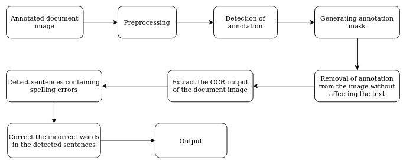

# OCR-correction
We proposed an end-to-end method for correcting errors in annotation affected documents images. For detailed understanding please refer to the [thesis]('thesis.pdf')

### Prerequisites

This project is maintained on Python 3.7 version.

  - numpy == 1.18.2
  - cv2 =< 4.0 
  - tensorflow == 1.15.0
  - diplib

### WorkFlow

This project is done in two parts :                  
[1] Localization and Removal of annotation using image processing techniques.                    
[2] Spelling correction of OCR generated output using Natural Language Processing.     

  

### Localization and Removal of Annotation

In this part we intent to localize and remove the annotation from the document images. We implemented the following steps to achieve that :        
[1] Pre-processing - Correcting skew, changing DPI to 300, adaptive thresholding and removing noise using gaussion blur.        
[2] Localizing annotation by filtering out connected components having area more than some threshold value.         
[3] Creating annotation masks using path opening and closing operations (which is required for inpainting).       
[4] 

### Training 
#### Face Detection model

The training of face detection model is done in `Cartoon_Face_Detection.ipynb`. The trained weights can be downloaded from [here](something). Function for prediction on a new image is also present in this notebook.

#### Emotion Recognition Model
Run the `train.sh` file to start the training.    
Prediction on a new image can be done using `get_prediction.py`  

### Outputs

  

  

  

  

