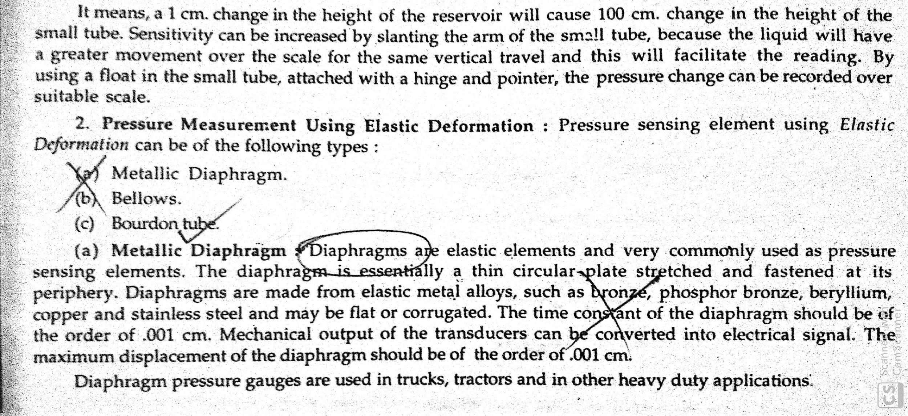
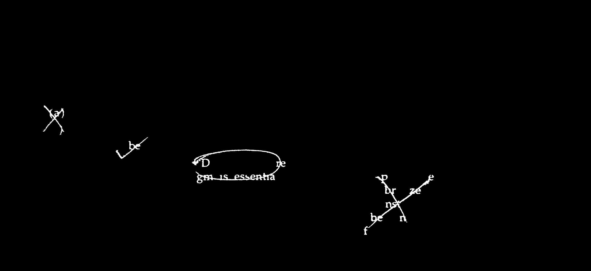
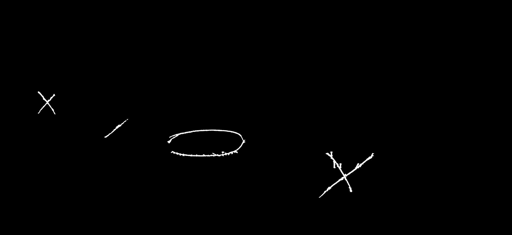
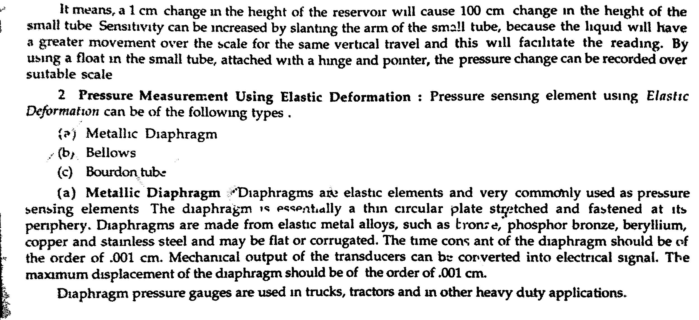

# OCR-correction
We proposed an end-to-end method for correcting errors in annotation affected document images. For detailed understanding please refer to our [thesis](Thesis.pdf).

### Prerequisites

This project is maintained on Python 3.7 version.

  - numpy == 1.18.2
  - cv2 =< 4.0 
  - tensorflow == 1.15.0
  - diplib

### WorkFlow

This project is done in two parts :                                                                                                            
                                                                                                                                                             
[1] Localization and Removal of annotation using image processing techniques.                    
[2] Spelling correction of OCR generated output using Natural Language Processing.     

  

### Localization and Removal of Annotation

In this part we intent to localize and remove the annotation from the document images. We implemented the following steps to achieve that :      
                
[1] Pre-processing - Correcting skew, changing DPI to 300, adaptive thresholding and removing noise using gaussion blur.        
[2] Localizing annotation by filtering out connected components having area more than some threshold value.         
[3] Creating annotation masks using path opening and closing operations (which is required for inpainting).       
[4] Regenerate the annotation affected text using inpainting.
                                                                                                                                                        
                                                                                                                

     <em>Input Image</em><em>Localized Annotation</em> 

     <em>Annotation Mask</em><em>Regenerated Image</em> 

### Spelling correction of OCR generated output
                                                                                                                                  
In this part we intent to correct the speling errors fro the OCR generated text. We proposed a post-processing technique using Natural Language
Processing and Deep Neural Networks. The solution is divided into two main parts :                                                             
                                                                                                                                               
[1] Dictionary based detection of incorrect words.                                                                                                
[2] Context based correction of incorrect words.                                                                                                    

#### Model Architecture                                                                                                                                     
Seq2Seq​ - Sequence-to-sequence [21] model was first proposed in machine translation. The idea was to translate one sequence to another sequence through an encoder-decoder neural architecture. We use the attention based approach as it provides an effective methodology to perform sequence-to-sequence (seq2seq) training. We have encoded a neural network which encodes the input sequence into a vector which has a fixed length and decoder neural network will generate each of words in the output sequence in turn, which is based on vector c and previously predicted words until it meets the word ending the sentence. In the seq2seq model, we can use different network architectures for encoder and decoder networks such as RNN or ​ convolutional
neural networks.
The basic seq2seq model has the disadvantage of requiring the RNN decoder to use the entire encoding information from the input sequence whether the sequence is long or short. Secondly, the RNN encoder needs to encode the input sequence into a single vector which has a fixed   length. This constraint is not really effective because, in fact, word generation at a time step in the output sequence sometimes depends more on certain components in the input sequence. For example, when translating a sentence from one language into another, we are more concerned
about the context surrounding the current word compared to the other words in the sentence. The
attention ​ technique is given to solve that problem.
Bidirectional RNN ​ - In bidirectional recurrent neural network (BRNN) [22] that can be trained using all available input information in the past and future of a specific time frame. It contains two hidden layers of opposite directions to the same output. The principle of BRNN is to split the neurons of a regular RNN into two directions, one for positive time direction (forward states), and another for negative time direction (backward states). Those two states’ output is not connected to inputs of the opposite direction states. The general structure of RNN and BRNN can be depicted in the right diagram. By using two-time directions, input information from the past and future of the current time frame can be used, unlike standard RNN which requires the delays for including
future information.
The structure of BRNN is an idea is to split the state neurons of a regular RNN in a part that is responsible for the positive time direction (forward states) and a part for the negative time direction (backward states). Outputs from forwarding states are not connected to inputs of backward states and vice versa. The BRNN can principally be trained with the same algorithms as a regular unidirectional RNN because there are no interactions between the two types of state
neurons and, therefore, can be unfolded into a general feed-forward network.                                                                                                                             
                                                                                                                                 

